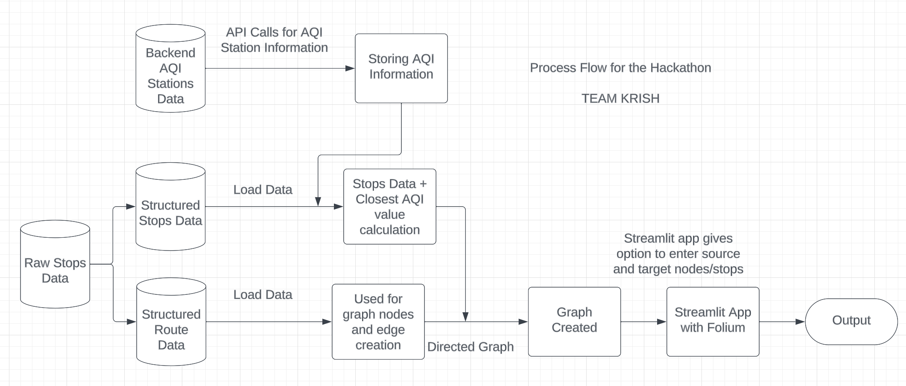
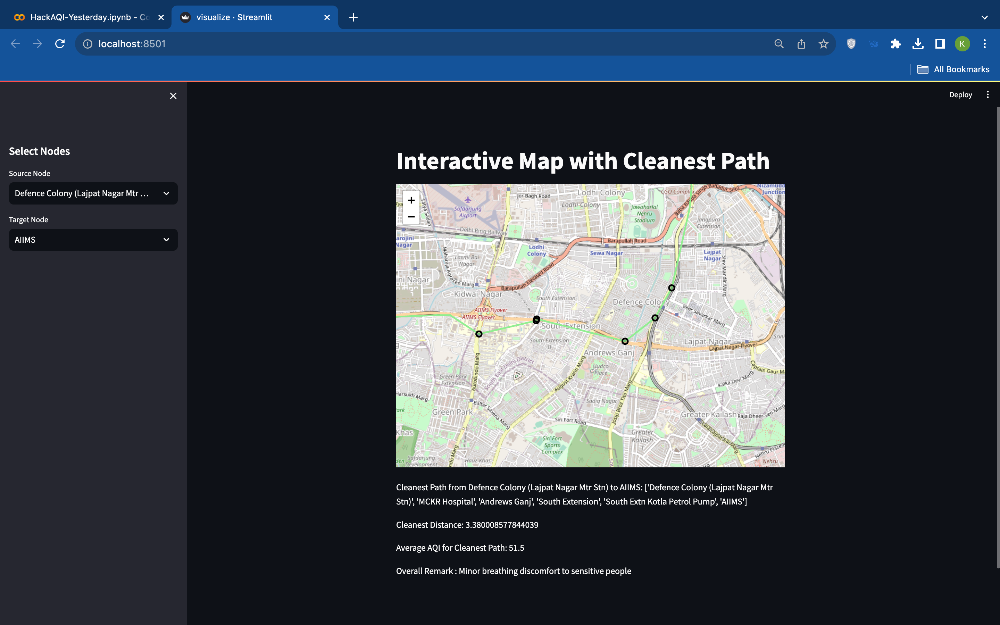

# AIR QUALITY HACKATHON - Respirer Living Sciences

#### Link for Hackathon: https://whereuelevate.com/drills/respirer-air-quality-hackathon

## Problem Statement

A common challenge of living in an Indian city is using public transport, especially buses, to commute between Location A and Location B. Naturally, commuters prefer the route that takes the least amount of time to reach their destination. However, Indian cities often face high traffic congestion and elevated levels of air pollution.

## Goal

The goal of this project is to find the cleanest (least polluted) route through the city, avoiding areas with high Air Quality Index (AQI) without significantly affecting travel time.

## Proposed Methodology

To achieve this goal, we follow the following methodology:

1. Perform API calls for specific date and time.
2. Use data from API calls: PM2.5 levels, Temperature, Pressure, and utilize PM2.5 levels throughout the selected time period to calculate the average AQI value for each monitoring station.
3. Perform geospatial analysis to calculate the proximity (distance) of each bus stop to the nearest air quality monitoring station and add that value to the stop's data.
4. Use trips data to obtain all the routes to be used as edges in the Directed graph.
5. Utilize the A* algorithm with AQI as the parameter for the greedy algorithm.
6. Create visualizations for each stop showing the path, nodes, cleanest route, and the average AQI value for that path.

For a visual representation of the cleanest route and the process flow, check the images below.

